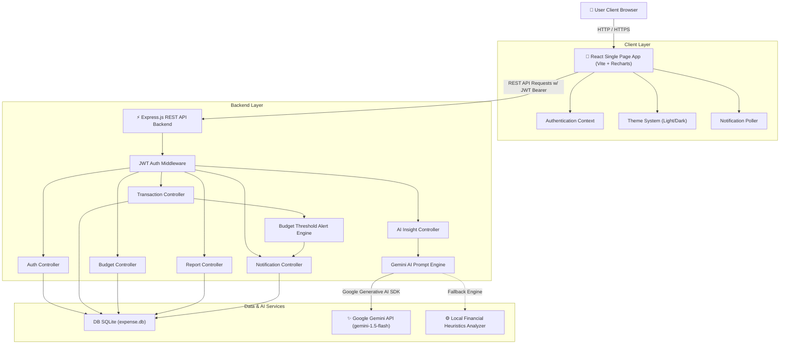

# Architecture Documentation — P12 Expense Management System

## 1. System Architecture Overview

The **P12 Expense Management System** follows a clean, decoupled 3-tier architecture:

1. **Presentation Layer (Frontend)**: Built with React, Vite, Recharts, and Vanilla CSS with CSS custom property tokens. Communicates asynchronously via REST APIs using Axios.
2. **Application Layer (Backend)**: Built with Express.js on Node.js. Enforces JWT authentication middleware, input validation, automated budget threshold alert triggers, and Google Gemini AI prompt generation.
3. **Data Layer (Database & External Services)**: SQLite embedded database for fast relational storage, coupled with Google Gemini Generative AI API for personalized financial insight analysis.

---

## 2. System Architecture Diagram

---

## 3. Component Architecture & Data Flow

### A. Authentication Flow
- User registers/logs in -> Server hashes password using `bcryptjs` -> Generates JWT token -> Saved in `localStorage` -> Attached to Axios `Authorization` header for protected endpoints.

### B. Transaction & Budget Alert Flow
- User submits transaction -> Backend validates positive amount and non-empty fields -> Inserts record into `transactions` table.
- If transaction type is `expense`, `budgetHelper.checkBudgetAlerts()` calculates current category spending vs allocated budget.
- If percentage spent >= 80%, >= 90%, or >= 100%, an automated record is created in `notifications` table.

### C. AI Spending Insight Flow
- User requests AI Insights / Financial Report -> Backend queries aggregated user income, expenses, category breakdown, and budget usage -> Constructs prompt payload -> Dispatches to Google Gemini API (`gemini-1.5-flash`).
- If API key is not configured, the fallback analyzer processes financial metrics using deterministic rule-based heuristics.
