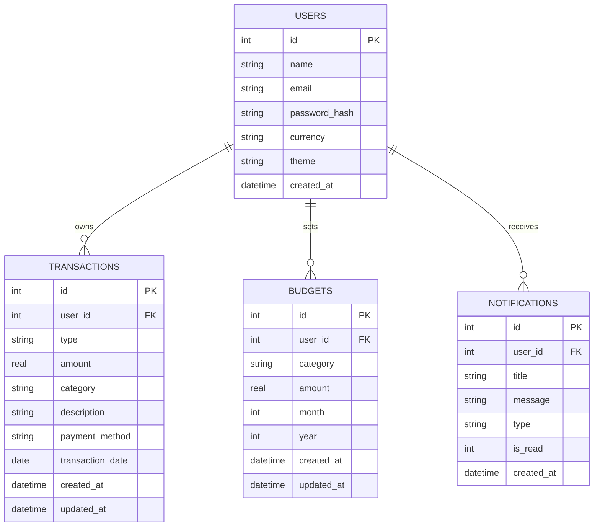

# Database Documentation — P12 Expense Management System

The **Xpense AI** application uses SQLite as an embedded relational database engine. The schema is initialized automatically by `server/database/db.js` on backend startup.

---

## 1. Entity-Relationship (ER) Diagram



---

## 2. Table Schemas & Data Dictionaries

### A. `users` Table
Stores user account profiles and settings.

| Column | Data Type | Constraints | Description |
| :--- | :--- | :--- | :--- |
| `id` | `INTEGER` | `PRIMARY KEY AUTOINCREMENT` | Unique User Identifier |
| `name` | `TEXT` | `NOT NULL` | User's full display name |
| `email` | `TEXT` | `NOT NULL UNIQUE` | User's login email address (lowercased) |
| `password_hash` | `TEXT` | `NOT NULL` | Bcrypt hashed password string |
| `currency` | `TEXT` | `DEFAULT 'INR'` | Preferred currency symbol (`INR` / `USD`) |
| `theme` | `TEXT` | `DEFAULT 'light'` | Preferred UI theme mode (`light` / `dark`) |
| `created_at` | `DATETIME` | `DEFAULT CURRENT_TIMESTAMP` | Account creation timestamp |

---

### B. `transactions` Table
Stores user financial transactions (income and expense entries).

| Column | Data Type | Constraints | Description |
| :--- | :--- | :--- | :--- |
| `id` | `INTEGER` | `PRIMARY KEY AUTOINCREMENT` | Unique Transaction Identifier |
| `user_id` | `INTEGER` | `NOT NULL, FK -> users(id)` | Foreign Key referencing User |
| `type` | `TEXT` | `CHECK(type IN ('income', 'expense'))` | Transaction type |
| `amount` | `REAL` | `NOT NULL CHECK(amount > 0)` | Monetary amount (must be positive) |
| `category` | `TEXT` | `NOT NULL` | Transaction category (Food, Salary, etc.) |
| `description` | `TEXT` | `NOT NULL` | Transaction description / notes |
| `payment_method`| `TEXT` | `NOT NULL` | Payment method (UPI, Bank Transfer, Cash, Card) |
| `transaction_date`|`DATE` | `NOT NULL` | Date when transaction occurred (`YYYY-MM-DD`) |
| `created_at` | `DATETIME` | `DEFAULT CURRENT_TIMESTAMP` | Timestamp when entry was created |
| `updated_at` | `DATETIME` | `DEFAULT CURRENT_TIMESTAMP` | Timestamp when entry was modified |

---

### C. `budgets` Table
Stores monthly budget target allocations set per category.

| Column | Data Type | Constraints | Description |
| :--- | :--- | :--- | :--- |
| `id` | `INTEGER` | `PRIMARY KEY AUTOINCREMENT` | Unique Budget Identifier |
| `user_id` | `INTEGER` | `NOT NULL, FK -> users(id)` | Foreign Key referencing User |
| `category` | `TEXT` | `NOT NULL` | Budget category (Food, Shopping, etc.) |
| `amount` | `REAL` | `NOT NULL CHECK(amount > 0)` | Allocated budget limit amount |
| `month` | `INTEGER` | `CHECK(month BETWEEN 1 AND 12)` | Budget month (1-12) |
| `year` | `INTEGER` | `NOT NULL` | Budget year (`YYYY`) |
| `created_at` | `DATETIME` | `DEFAULT CURRENT_TIMESTAMP` | Timestamp when budget target was created |
| `updated_at` | `DATETIME` | `DEFAULT CURRENT_TIMESTAMP` | Timestamp when budget target was modified |

> **Unique Constraint**: `UNIQUE(user_id, category, month, year)` prevents duplicate budget allocations for the same category in the same month.

---

### D. `notifications` Table
Stores system notifications, automated budget threshold alerts, and AI insights alerts.

| Column | Data Type | Constraints | Description |
| :--- | :--- | :--- | :--- |
| `id` | `INTEGER` | `PRIMARY KEY AUTOINCREMENT` | Unique Notification Identifier |
| `user_id` | `INTEGER` | `NOT NULL, FK -> users(id)` | Foreign Key referencing User |
| `title` | `TEXT` | `NOT NULL` | Short alert title |
| `message` | `TEXT` | `NOT NULL` | Alert message body text |
| `type` | `TEXT` | `CHECK(type IN ('budget_warning', 'budget_exceeded', 'system', 'ai'))` | Alert classification category |
| `is_read` | `INTEGER` | `DEFAULT 0 CHECK(is_read IN (0, 1))` | Read status (`0` = Unread, `1` = Read) |
| `created_at` | `DATETIME` | `DEFAULT CURRENT_TIMESTAMP` | Timestamp when alert was logged |

---

## 3. Database Indexes

High-performance database indexes configured in `server/database/db.js`:

```sql
CREATE INDEX IF NOT EXISTS idx_transactions_user ON transactions(user_id);
CREATE INDEX IF NOT EXISTS idx_transactions_date ON transactions(transaction_date);
CREATE INDEX IF NOT EXISTS idx_transactions_category ON transactions(category);
CREATE INDEX IF NOT EXISTS idx_budgets_user_month ON budgets(user_id, month, year);
CREATE INDEX IF NOT EXISTS idx_notifications_user ON notifications(user_id, is_read);
```

---

## 4. Foreign Key Constraints & Data Integrity

- Foreign key constraints are enforced on every database connection via `PRAGMA foreign_keys = ON;`.
- On deleting a user record (`users.id`), `ON DELETE CASCADE` automatically purges all associated transactions, budgets, and notifications for that user to ensure clean state and data isolation.
